<!-- Generated by Suite Builder. EDIT RULES: do not edit this file; regenerating replaces all of it. Your own notes on the site go in ai/AI-README.md. -->
# The site's shape

https://atos.net as the crawl saw it: each box a kind of page (its class and address), each arrow a link
between them. A solid arrow is followed by a navigation test; a dotted one is not, and why is below.
Navigation tests follow 167 of 193 transitions (coverage: transitions);
every kind of page is opened by its smoke test, 38 of 38.

```mermaid
flowchart LR
  n0["SiteDetailPage<br/>/*"]
  n1["SiteDetailPage2<br/>/en/*/*"]
  n2["SiteDetailPage3<br/>/en/*"]
  n3["BlogDetailPage<br/>/en/blog/*"]
  n4["SiteDetailPage4<br/>/en/*/*/*"]
  n5["SiteDetailPage5<br/>/en/*/*/*"]
  n6["AlliancesPartnershipsDetailPage<br/>/en/alliances-partnerships/*/*"]
  n7["EventsDetailPage<br/>/en/events/*"]
  n8["ClientSuccessClientStoriesDetailPage<br/>/en/client-success/client-stories/*"]
  n9["LpDetailPage<br/>/en/lp/*"]
  n10["SiteDetailPage6<br/>/en/*/*/*"]
  n11["LpDetailPage2<br/>/en/lp/*"]
  n12["PrivacyCookiesAndOtherPage<br/>/en/privacy/cookies-and-other-tracking-technologies"]
  n13["SiteDetailPage7<br/>/en/*/*/*/*"]
  n14["LpDetailPage3<br/>/en/lp/*"]
  n15["LpDigitalSecurityMagazinePage<br/>/en/lp/digital-security-magazine-20th-edition"]
  n16["LpDetailPage4<br/>/en/lp/*/*"]
  n17["LpOperationalizingAiOvercomingPage<br/>/en/lp/operationalizing-ai-overcoming-the-challenges"]
  n18["ExerciseRightsRegardingPersonalPage<br/>/en/exercise-rights-regarding-personal-data"]
  n19["SiteDetailPage8<br/>/en/{n}/*/*"]
  n20["ClientSuccessClientStoriesPage<br/>/en/client-success/client-stories"]
  n21["ExpertDetailPage<br/>/en/expert/*"]
  n22["SiteDetailPage9<br/>/en/*"]
  n23["IndustriesDetailPage<br/>/en/industries/*"]
  n24["LpAtosThreatResearchPage<br/>/en/lp/atos-threat-research-center"]
  n25["LpDetailPage5<br/>/en/lp/*/*"]
  n26["LpCybershieldDetailPage<br/>/en/lp/cybershield/*"]
  n27["WorldwideLocationsPage<br/>/en/worldwide-locations"]
  n28["LpDetailPage6<br/>/en/lp/*"]
  n29["LpDigitalSovereigntyForPage<br/>/en/lp/digital-sovereignty-for-switzerland"]
  n30["IndustriesDetailPage2<br/>/en/industries/*/*"]
  n31["IndustriesPage<br/>/en/industries"]
  n32["NewsroomPage<br/>/en/newsroom"]
  n33["NewsroomBrandCenterPage<br/>/en/newsroom/brand-center"]
  n34["LpDigitalSecurityMagazinePage2<br/>/en/lp/digital-security-magazine-18"]
  n35["BlogPage<br/>/en/blog"]
  n36["LpDigitalSovereigntyAnPage<br/>/en/lp/digital-sovereignty-an-atos-strategic-growth-pillar"]
  n37["ClientSuccessPage<br/>/en/client-success"]
  n38(["/en/services/cloud-and-modern-infrastructure/sovereign-cloud<br/>not read"])
  n39(["/en/services/cybersecurity/security-advisory<br/>not read"])
  n40(["/en/services/cybersecurity/security-testing-services<br/>not read"])
  n41(["/en/services/cybersecurity/threat-detection-investigation-and-response<br/>not read"])
  n42(["/en/services/digital-applications/intelligent-automation<br/>not read"])
  n43(["/en/services/digital-applications/internet-of-things<br/>not read"])
  n44(["/en/services/digital-applications/low-code-solutions<br/>not read"])
  n45(["/en/services/smart-platforms<br/>not read"])
  n46(["/en/services/smart-platforms/sap-services<br/>not read"])
  n47(["/en/services/smart-platforms/servicenow<br/>not read"])
  n48(["/en/services/sustainability-services<br/>not read"])
  n49(["/en/industries/manufacturing<br/>not read"])
  n50(["/en/industries/public-sector-and-defense<br/>not read"])
  n51(["/en/industries/retail-transport-and-logistics<br/>not read"])
  n52(["/en/industries/telecom-media-and-technology<br/>not read"])
  n53(["/en/flender-china-accelerating-engineering-excellence-with-agentic-ai<br/>not read"])
  n54(["/en/events<br/>not read"])
  n55(["/en/insights<br/>not read"])
  n56(["/en/alliances-partnerships<br/>not read"])
  n57(["/en/analyst-relations<br/>not read"])
  n58(["/en/iso-certification<br/>not read"])
  n59(["/en/scaler-the-open-innovation-accelerator<br/>not read"])
  n60(["/en/who-we-are<br/>not read"])
  n61(["/en/join-us<br/>not read"])
  n62(["/en/accessibility-statement<br/>not read"])
  n0 -.-> n8
  n0 -.-> n3
  n0 -.-> n15
  n1 --> n1
  n1 -.-> n12
  n1 -.-> n18
  n2 --> n3
  n2 -.-> n8
  n2 --> n9
  n2 --> n11
  n2 -.-> n26
  n2 -.-> n29
  n3 --> n3
  n3 --> n1
  n3 --> n4
  n3 --> n19
  n3 --> n21
  n3 --> n30
  n3 --> n36
  n3 --> n5
  n3 --> n8
  n3 --> n10
  n3 --> n16
  n4 --> n19
  n4 --> n8
  n4 --> n3
  n4 --> n4
  n4 --> n1
  n4 --> n13
  n4 -.-> n14
  n4 --> n9
  n4 --> n5
  n4 -.-> n6
  n4 --> n11
  n4 -.-> n28
  n5 --> n19
  n5 --> n4
  n5 --> n3
  n5 --> n1
  n5 -.-> n8
  n5 -.-> n10
  n5 -.-> n13
  n5 --> n14
  n5 -.-> n17
  n6 --> n4
  n6 --> n1
  n6 -.-> n5
  n6 --> n6
  n8 --> n8
  n8 --> n10
  n8 --> n4
  n10 --> n3
  n10 -.-> n19
  n10 --> n4
  n10 --> n8
  n11 --> n4
  n11 --> n3
  n11 --> n19
  n13 --> n13
  n13 -.-> n19
  n13 --> n3
  n14 --> n8
  n15 --> n16
  n15 --> n21
  n16 --> n15
  n16 --> n1
  n16 --> n16
  n16 --> n21
  n19 --> n19
  n19 --> n4
  n19 --> n28
  n19 --> n5
  n19 --> n11
  n20 -.-> n0
  n22 --> n1
  n22 --> n2
  n22 --> n8
  n22 --> n19
  n23 --> n19
  n23 -.-> n8
  n23 -.-> n15
  n23 -.-> n24
  n24 -.-> n25
  n24 -.-> n19
  n24 --> n26
  n25 --> n26
  n25 --> n15
  n25 --> n34
  n25 --> n25
  n26 --> n26
  n26 -.-> n15
  n26 -.-> n34
  n28 --> n4
  n29 --> n3
  n30 --> n19
  n32 --> n19
  n32 --> n33
  n34 --> n21
  menu{{"Header and footer: on every page"}}
  menu --> n1
  menu --> n22
  menu --> n22
  menu --> n22
  menu --> n22
  menu --> n22
  menu --> n22
  menu --> n2
  menu --> n22
  menu --> n22
  menu --> n27
  menu --> n4
  menu --> n5
  menu --> n5
  menu --> n4
  menu --> n5
  menu --> n5
  menu --> n4
  menu --> n5
  menu --> n38
  menu --> n4
  menu --> n23
  menu --> n6
  menu --> n10
  menu --> n10
  menu --> n10
  menu --> n39
  menu --> n40
  menu --> n41
  menu --> n4
  menu --> n4
  menu --> n4
  menu --> n30
  menu --> n4
  menu --> n6
  menu --> n4
  menu --> n4
  menu --> n42
  menu --> n43
  menu --> n44
  menu --> n5
  menu --> n5
  menu --> n10
  menu --> n4
  menu --> n10
  menu --> n4
  menu --> n45
  menu --> n4
  menu --> n4
  menu --> n4
  menu --> n46
  menu --> n47
  menu --> n5
  menu --> n48
  menu --> n21
  menu --> n4
  menu --> n4
  menu --> n23
  menu --> n49
  menu --> n50
  menu --> n51
  menu --> n52
  menu --> n31
  menu --> n32
  menu --> n19
  menu --> n19
  menu --> n2
  menu --> n35
  menu --> n3
  menu --> n3
  menu --> n3
  menu --> n3
  menu --> n37
  menu --> n53
  menu --> n5
  menu --> n8
  menu --> n8
  menu --> n20
  menu --> n54
  menu --> n7
  menu --> n7
  menu --> n7
  menu --> n7
  menu --> n55
  menu --> n56
  menu --> n57
  menu --> n58
  menu --> n59
  menu --> n27
  menu --> n60
  menu --> n61
  menu --> n62
  menu --> n1
  menu --> n1
  menu --> n0
```

## Not followed

- SiteDetailPage to ClientSuccessClientStoriesDetailPage: hidden when the page loads (a closed menu, a carousel's other slide)
- SiteDetailPage to BlogDetailPage: hidden when the page loads (a closed menu, a carousel's other slide)
- SiteDetailPage to LpDigitalSecurityMagazinePage: hidden when the page loads (a closed menu, a carousel's other slide)
- SiteDetailPage2 to PrivacyCookiesAndOtherPage: seen only on a page open() cannot reach
- SiteDetailPage2 to ExerciseRightsRegardingPersonalPage: hidden when the page loads (a closed menu, a carousel's other slide)
- SiteDetailPage3 to ClientSuccessClientStoriesDetailPage: hidden when the page loads (a closed menu, a carousel's other slide)
- SiteDetailPage3 to LpCybershieldDetailPage: hidden when the page loads (a closed menu, a carousel's other slide)
- SiteDetailPage3 to LpDigitalSovereigntyForPage: hidden when the page loads (a closed menu, a carousel's other slide)
- SiteDetailPage4 to LpDetailPage3: seen only on a page open() cannot reach
- SiteDetailPage4 to AlliancesPartnershipsDetailPage: seen only on a page open() cannot reach
- SiteDetailPage4 to LpDetailPage6: seen only on a page open() cannot reach
- SiteDetailPage5 to ClientSuccessClientStoriesDetailPage: hidden when the page loads (a closed menu, a carousel's other slide)
- SiteDetailPage5 to SiteDetailPage6: seen only on a page open() cannot reach
- SiteDetailPage5 to SiteDetailPage7: seen only on a page open() cannot reach
- SiteDetailPage5 to LpOperationalizingAiOvercomingPage: seen only on a page open() cannot reach
- AlliancesPartnershipsDetailPage to SiteDetailPage5: seen only on a page open() cannot reach
- SiteDetailPage6 to SiteDetailPage8: seen only on a page open() cannot reach
- SiteDetailPage7 to SiteDetailPage8: seen only on a page open() cannot reach
- ClientSuccessClientStoriesPage to SiteDetailPage: hidden when the page loads (a closed menu, a carousel's other slide)
- IndustriesDetailPage to ClientSuccessClientStoriesDetailPage: seen only on a page open() cannot reach
- IndustriesDetailPage to LpDigitalSecurityMagazinePage: seen only on a page open() cannot reach
- IndustriesDetailPage to LpAtosThreatResearchPage: hidden when the page loads (a closed menu, a carousel's other slide)
- LpAtosThreatResearchPage to LpDetailPage5: hidden when the page loads (a closed menu, a carousel's other slide)
- LpAtosThreatResearchPage to SiteDetailPage8: hidden when the page loads (a closed menu, a carousel's other slide)
- LpCybershieldDetailPage to LpDigitalSecurityMagazinePage: seen only on a page open() cannot reach
- LpCybershieldDetailPage to LpDigitalSecurityMagazinePage2: seen only on a page open() cannot reach
